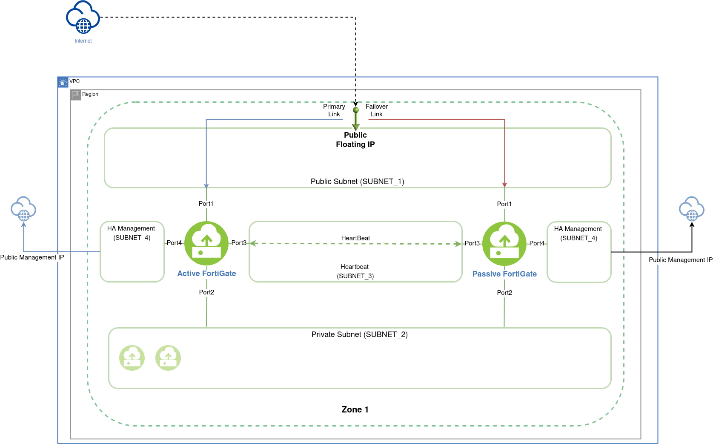
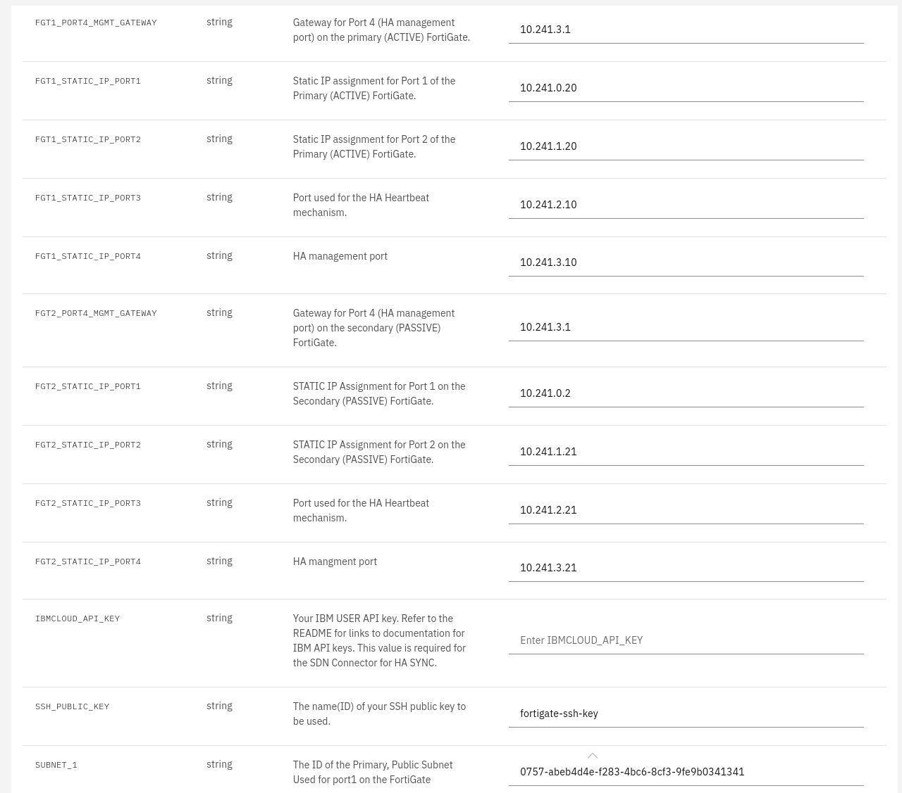

## Description

A Terraform script to deploy an Active-Passive (A-P) HA cluster in a single zone. This template makes use of the FortiGate IBM SDN connector to failover in the event of a VM shutdown.
After the active VM is back up, it will take over as active once again.

## Requirements

-   [Terraform](https://learn.hashicorp.com/terraform/getting-started/install.html) 0.13+
-   Two FortiOS 7.0 BYOL Licenses.
-   [A VPC with four subnets in a single zone](https://cloud.ibm.com/docs/vpc/vpc-getting-started-with-ibm-cloud-virtual-private-cloud-infrastructure)
-   [A configured IBM SSH key](https://cloud.ibm.com/docs/vpc?topic=vpc-ssh-keys)
-   [A public gateway](https://cloud.ibm.com/docs/vpc?topic=vpc-about-public-gateways) attached to the public subnet (its ID is a required input)

## Deployment overview

> **Note:** For a local deployment, a Gen 2 API key will be needed. For details see [IBM Gen 2 API key](https://cloud.ibm.com/docs/account?topic=account-userapikey&interface=ui#create_user_key).

Terraform deploys the following components:

-   Two FortiGate BYOL instances with four NICs each, one in each subnet.
-   Three floating Public IP addresses: one attached to the Primary FortiGate on Port1, which will failover and the other two attached to the HA management port (Port4) of each FortiGate.
-   One log disk per FortiGate.
-   A basic bootstrap configuration with HA support.
-   Two security groups, created and attached automatically (see [Security groups](#security-groups) below).

### Security groups

The template creates and attaches two security groups — no pre-existing security group is required.

| Security group | Attached to | Direction | Protocol / Port | Remote | Purpose |
| -------------- | ----------------------------------------- | -------- | --------------- | ------------------- | ------------------------------------------ |
| **Public** | Port1 (external), Port4 (HA management) | Inbound | TCP 443 | `0.0.0.0/0` | HTTPS admin GUI access *(see Note below)* |
| | | Inbound | All | Same security group | Traffic between cluster members |
| | | Outbound | UDP 53 | `0.0.0.0/0` | FortiGuard DNS & SDNS queries |
| | | Outbound | TCP 443 | `0.0.0.0/0` | Licensing, FortiCare & IBM SDN connector |
| | | Outbound | TCP 8890 | `0.0.0.0/0` | FortiGuard distribution updates |
| **Private** | Port2 (internal), Port3 (HA heartbeat) | Inbound | All | Same security group | HA heartbeat/sync between cluster members |
| | | Outbound | All | Same security group | HA heartbeat/sync between cluster members |

> **Note:** The inbound HTTPS rule is open to `0.0.0.0/0` to allow initial access to the admin GUI. After initial configuration, it is recommended to lock the rule's remote down to a trusted host or CIDR.

# Deployment Diagram

## Deployment

> **Note:** For Subnets, the UUID is required.

1. Fill in the required Subnets, public gateway and VPC information as shown in the example below:

   

  

3. Apply the plan.
4. Outputs, such as the **Public IP**, **Default username and password** and the names of the created **Security Groups** can be found under the `View Log` link.

## Destroy the cluster

To destroy the cluster, click on `Actions...`->`Destroy`.

# Support

Fortinet-provided scripts in this and other GitHub projects do not fall under the regular Fortinet technical support scope and are not supported by FortiCare Support Services.
For direct issues, please refer to the [Issues](https://github.com/fortinet/ibm-fortigate-terraform-deploy/issues) tab of this GitHub project.
For other questions related to this project, contact [github@fortinet.com](mailto:github@fortinet.com).

## License

[License](https://github.com/fortinet/ibm-fortigate-terraform-deploy/blob/main/LICENSE) © Fortinet Technologies. All rights reserved.
